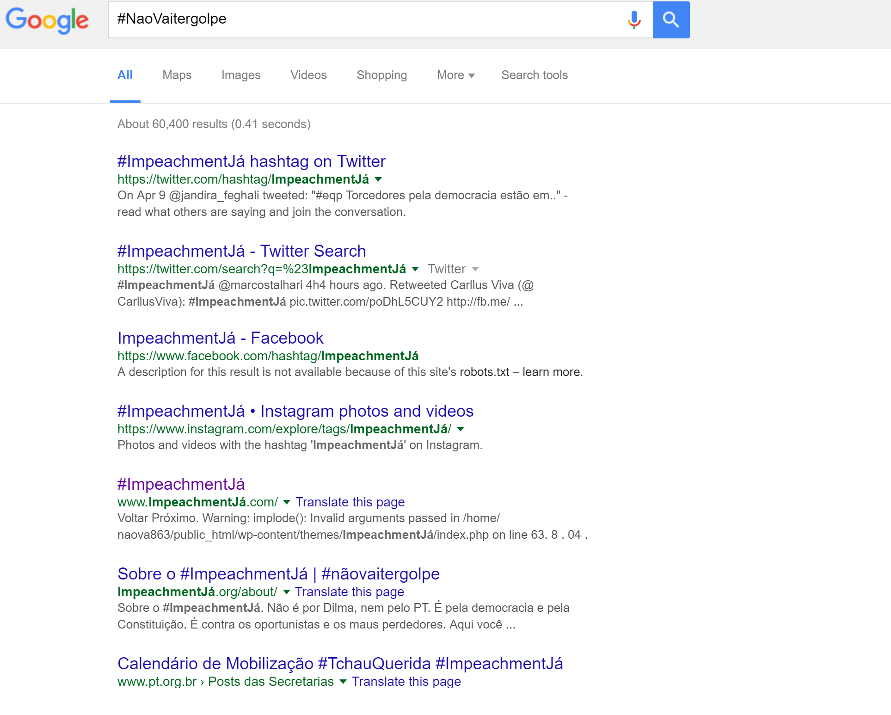

Não É Golpe!
============

Extensão para Google Chrome que substitui quaisquer menções de '#NaoVaiTerGolpe' por '#ImpeachmentJa', '#FicaDilma' por '#TchauQuerida', 'golpista' por 'legitimo', 'Não vai ter golpe' por 'Não vai ter golpe - VAI TER IMPEACHMENT!', e finalmente quaisquer outras menções da palavra 'golpe' por 'Impeachment'. 

Ajude os seus amigos que sofreram um golpe cerebral e acreditam que o Brasil está sofrendo um golpe. Argumentos, exemplos e explicações não são eficáses, pois os golpeados não mais mantém contato com a realidade. Em suas lutas imaginárias, defendem a naçãos de inimigos fictícios. Acreditam que é tudo culpa da Globo, do FMI e dos malditos capitalistas imperialistas dominadores de classe trabalhadora de nobre coração que vai todos os dias ao bosque recolher lenha. Mas você pode ajudar!! Recomende que os seus amigos golpeados instalem esta extensão. Se os sintomas não diminuirem com o tempo, consulte um médico.

Instação
--------

No Google Chrome, abra o menu Janela > Extensões. Arraste o arquivo NaoEhGolpe.crx na página que aparecer.

In Chrome, choose Window > Extensions.  Drag NaoEhGolpe.crx into the page that appears.

Exemplo
-------

Curtiu? 
-------

Me manda um copo de café, sem o qual esta extensão não seria possível! :D

Paypal: nosachamos@gmail.com
